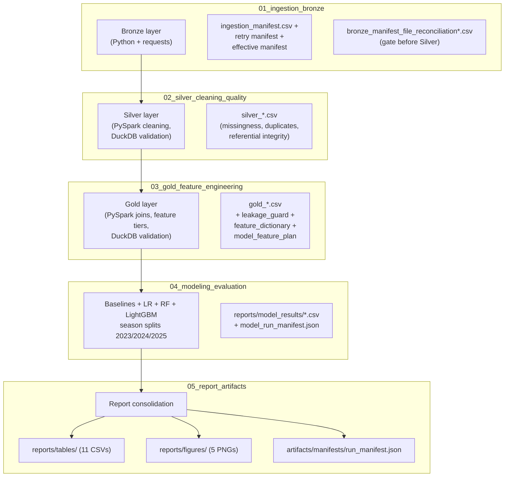

# Figure 1 — Medallion architecture diagram (placeholder)

This file is a placeholder for the **Medallion architecture diagram** referenced as Figure 1 in §3.1 of the final report. The Mermaid diagram below is rendered inline on GitHub and is sufficient for the report draft and the in-repo evidence bundle. Replace this file with a polished PNG (FigJam / draw.io / Lucidchart) before the final PDF submission if a designed diagram is preferred.

## Pipeline layers

```mermaid
flowchart LR
    api["OpenF1 API\n(https://api.openf1.org/v1)"] -->|requests + retry| bronze
    bronze["Bronze\nimmutable JSONL\nper (endpoint, year, session_key)"] -->|PySpark + DuckDB validation| silver
    silver["Silver\ntyped, cleaned Parquet\n(non-destructive)"] -->|PySpark + DuckDB validation| gold
    gold["Gold\ndriver-race feature mart\n1,756 rows x 62 cols\n40 model features"] -->|pandas + sklearn / LightGBM| modeling
    modeling["Modeling\n3 baselines + 3 ML models\nseason splits 2023/2024/2025"] -->|matplotlib + pandas| reports
    reports["Reports\nreports/tables/, reports/figures/\nrun_manifest.json"]
```

## Engine and provenance overlay

## Technology rationale (one-glance)

| Layer | Primary engine | Validation engine | Reporting / handoff |
|-------|----------------|-------------------|---------------------|
| Bronze ingestion | Python + `requests` | PySpark Bronze reports + DuckDB SQL | pandas CSV summaries |
| Silver cleaning | **PySpark** (`SILVER_ENGINE=spark`) | DuckDB SQL | pandas CSV summaries |
| Gold feature mart | **PySpark** (`GOLD_ENGINE=spark`) | DuckDB SQL | pandas CSV summaries |
| Modeling | pandas + scikit-learn + LightGBM | — | pandas CSV + matplotlib PNG |
| Report artifacts | pandas + matplotlib | — | CSV + PNG |

Databricks is **out of scope**; PySpark runs locally inside Google Colab via `get_spark()`. DuckDB provides independent SQL cross-checks of Spark and pandas outputs at every layer.

## Replacement guidance

When producing the final PDF, replace this file with a rendered PNG (e.g. `architecture_diagram.png`) and update the Figure 1 reference in [`reports/report_draft/table_figure_register.md`](../../../../reports/report_draft/table_figure_register.md) and [`reports/report_draft/report_structure.md`](../../../../reports/report_draft/report_structure.md) §3.1 accordingly. The Mermaid source above can be exported via the GitHub renderer or pasted into [https://mermaid.live](https://mermaid.live) for a quick PNG export.
